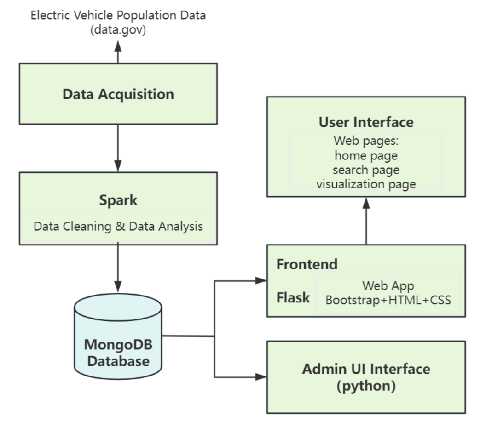

# Electric Vehicle Data Platform

## What's This All About?

Welcome to the Electric Vehicle (EV) Data Platform! Our system is designed to manage large amounts of EV data across multiple databases. This helps us handle data efficiently and make it easy for everyone to understand EV trends and statistics.

## Architecture Design

## Project Files Structure
DS551Project-EVDataPlatform
├── Electric_Vehicle_Population_Data_Cleaned
├── static
│   ├── css
│   ├── images
│   └── js
│       └── favicon.ico
├── templates
├── dataClean.py
├── db_management.py
├── Electric_Vehicle_Population_Data.csv
├── main.py
├── Requirements.txt
└── uploadToMongoDB.py

## Key Features

### MongoDB for Distributed Data Management

- **Why MongoDB?** It is scalable, powerful, and good at handling large amounts of data, making it our chosen database for storing and organizing EV data.
- **Smart Data Storage**: Unique identifiers are assigned to each record via a hash function, optimizing data retrieval and storage efficiency.
- **Data Partitioning**: We distribute data to two databases based on hash values(cut-off year), ensuring efficient data handling.

### Real-Time Data Processing with Spark DataFrame

- **Fast Data Processing**: Using Spark DataFrame, we transform and analyze data in real-time, quickly extracting valuable features.
- **Efficient Computations**: Thanks to Spark's distributed nature, we process vast datasets efficiently, ensuring timely analytics.

### Interactive Web Application

- **Dual Interfaces**: Tailored experiences for both casual users and database managers.
- **Lookup Page**: Explore and interact with EV data through advanced search and aggregation tools.
- **Visualization Page**: Engage with data through interactive visualizations that make trends easy to understand.
- **Database Manager’s Interface**: Direct database interactions via a Python-powered backend for precise control over data operations. Database managers can add, remove, or change records easily. These changes are smartly sent to the correct database.

## Setup Instructions
### Data Preparation
- Download the _Electric_Vehicle_Population_Data.csv_ file, which contains the electric vehicle population data, to your local machine.

### MongoDB Compass Setup
- **Install MongoDB Compass**: Download and install MongoDB Compass from the [official MongoDB website](https://www.mongodb.com/try/download/shell).
- **Connect to MongoDB**: Launch MongoDB Compass and connect to your local MongoDB instance. If you haven't set up MongoDB locally, follow the [official installation instructions](https://www.mongodb.com/docs/manual/administration/install-community/) to install and configure MongoDB.

## Data Cleaning
Execute the dataClean.py script to perform data cleaning on the original Electric Vehicle Population Data CSV file. 
'''python dataClean.py''' 
This script will read the CSV file, perform data cleaning operations, and write the cleaned data to a new file named Electric_Vehicle_Population_Data_Cleaned which contains several CVS files.

## Data Upload
Run the uploadToMongoDB.py script to split the cleaned data into two databases and upload it to MongoDB Compass. Ensure that MongoDB Compass is running and properly configured. 
'''python uploadToMongoDB.py'''

## Database Management
The db_management.py script provides functionality to perform CRUD (Create, Read, Update, Delete) operations on the data stored in the MongoDB database. 
'''python db_management.py'''

## Web Application
Run the main.py script to start the Flask web application. This will launch a web interface where you can explore and visualize the electric vehicle population data.
The static folder contains CSS, JavaScript, and image files used by the web application. 
'''python main.py

## Wrapping Up

Our Electric Vehicle Data Platform is powerful and designed to handle lots of data with ease. We use a combination of MongoDB, PySpark, Flask, and JavaScript to make sure our platform works well and meets the needs of both database managers and regular users.

### Thank You!

We appreciate your interest in our project. Your feedback and contributions are welcome as we continue to refine and expand our platform.

